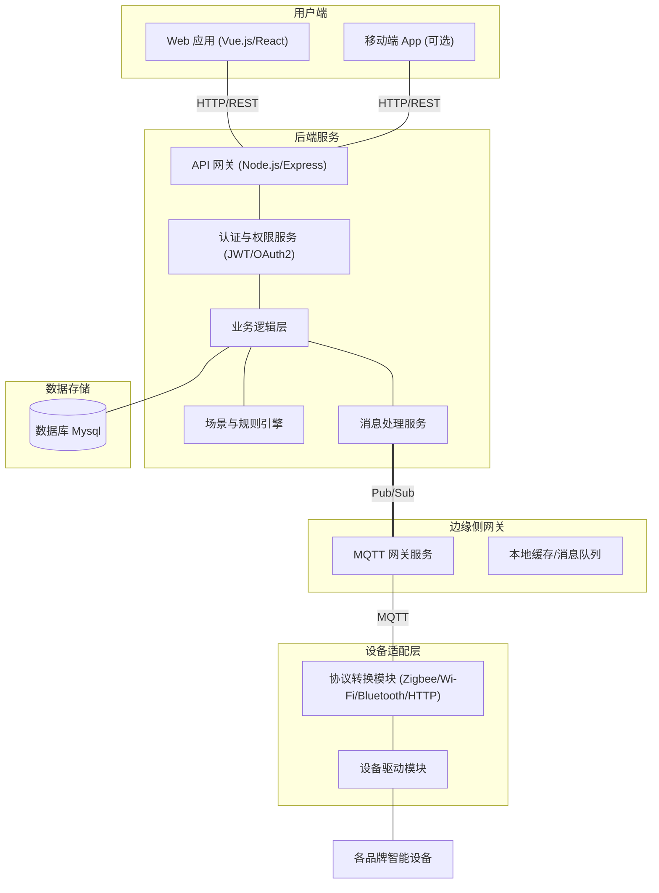

# 全屋智能设备一体化控制系统

## 项目简介

全屋智能设备一体化控制系统旨在为用户提供一个集中、统一的界面和接口，实现对家中各种智能设备（如智能灯光、空调、窗帘、安防设备等）的便捷控制与管理，提升家居智能化体验和生活品质。

Xiaomi Home Integration 是由小米官方支持的 Home Assistant 集成组件 ([GitHub - XiaoMi/ha_xiaomi_home: Xiaomi Home Integration for Home Assistant](https://github.com/XiaoMi/ha_xiaomi_home#:~:text=Xiaomi%20Home%20Integration%20is%20an,smart%20devices%20in%20Home%20Assistant))，允许在 Home Assistant 中使用小米 IoT 智能设备。本项目受该集成的启发，旨在构建一个智能家居集成平台，实现对多种智能设备的统一管理和控制。平台采用前后端分离的架构设计，具有良好的可扩展性，并强调系统的易用性和稳定性。

Home Assistant 是一款免费的开源家庭自动化软件 ([Home Assistant - Wikipedia](https://en.wikipedia.org/wiki/Home_Assistant#:~:text=Home%20Assistant%20is%20free%20and,by%20using%20%2090%20companion))，本项目在设计上借鉴了其本地化控制和隐私保护理念。平台将支持常见的智能家居协议和标准，包括 MQTT 等轻量级通信协议 ([Home Assistant - Wikipedia](https://en.wikipedia.org/wiki/Home_Assistant#:~:text=Home%20Assistant%20as%20such%20supports,party%20integration%20over)) ([MQTT - The Standard for IoT Messaging](https://mqtt.org/#:~:text=MQTT%20is%20an%20OASIS%20standard,a%20wide%20variety%20of%20industries))，以确保设备互联互通和高效的数据传输。用户可以通过 Web 界面方便地监控和管理设备状态。

## 功能需求

- **设备管理**：
  - 支持设备添加、删除、编辑、分组操作。
  - *设备发现。自动发现环境中可添加的设备。
  - 实现对各类智能设备（如灯、传感器、摄像头等）的单独和分组管理。
- **远程控制**：提供友好的 Web 界面和移动端接口，允许用户随时随地查看和控制设备状态。
- **自动化与场景**：
  - 支持场景模式的创建、编辑和一键切换。
  - *支持定时任务和基于事件的自动化脚本，触发灯光、气候等设备或对应的场景 ([Home Assistant - Wikipedia](https://en.wikipedia.org/wiki/Home_Assistant#:~:text=Information%20from%20all%20devices%20and,entertainment%20systems%20and%20smart%20home))。
- **实时监测**：通过 MQTT 等协议获取设备状态，实现数据的实时上报与可视化展示。
- **数据可视化**：提供仪表盘等可视化工具，用于展示设备状态、历史数据和环境信息。
- **安全与权限**：支持用户分级和权限管理，保证系统安全。
- \* **日志与告警**：记录运行日志，支持异常检测和告警通知，提升系统可靠性。

( `*` 标识的为扩展需求)

## 技术栈

- **前端**：Vue.js (渐进式 JavaScript 框架，用于构建交互式用户界面 ([Vue.js - The Progressive JavaScript Framework | Vue.js](https://vuejs.org/#:~:text=The%20Progressive%20JavaScript%20Framework)))。
- **后端**：Node.js (Express) (跨平台 JavaScript 运行时环境 ([Node.js — Run JavaScript Everywhere](https://nodejs.org/en#:~:text=Node.js%C2%AE%20is%20a%20free%2C%20open,command%20line%20tools%20and%20scripts))，便于构建高性能服务器)。
- **数据库**：Mysql 
- **通信协议**：MQTT (轻量级发布/订阅物联网消息协议 ([MQTT - The Standard for IoT Messaging](https://mqtt.org/#:~:text=MQTT%20is%20an%20OASIS%20standard,a%20wide%20variety%20of%20industries))，适用于远程设备通信)。
- 以上技术栈可根据实际开发需求进行调整。
- **自动化平台参考**：
  - [Home Assistant](https://www.home-assistant.io/)
  - [Xiaomi Home Integration for Home Assistant](https://github.com/XiaoMi/ha_xiaomi_home)

## 系统架构

```plaintext
+-------------+          +----------+         +--------------+
| 前端界面    | <------> | 后端服务 | <-----> | 设备适配层   |
| (Web/Mobile)|          | (API)    |         | (驱动/协议)  |
+-------------+          +----------+         +--------------+
                              |
                              v
                         +-----------+
                         | 数据存储  |
                         +-----------+
```

- **设备适配层**：封装各品牌设备的控制协议，提供统一接口。
- **后端服务**：处理业务逻辑、权限验证、状态同步等。
- **前端界面**：提供用户交互、场景管理和实时数据展示。



## 安装与部署

1. **克隆仓库**：  
   ```bash
   git clone <repository-url>
   cd <project-directory>
   ```

2. **安装依赖**：  
   - 后端：进入 `backend` 目录，运行 `npm install` 安装依赖。  
   - 前端：进入 `frontend` 目录，运行 `npm install` 安装依赖。

3. **配置环境变量**：复制 `.env.example` 为 `.env`，根据注释填写数据库连接、MQTT 服务器等配置项。例如：

   | 变量名        | 说明           | 示例                             |
   | ------------- | -------------- | -------------------------------- |
   | `PORT`        | 后端运行端口   | `3000`                           |
   | `MONGODB_URI` | MongoDB 连接串 | `mongodb://localhost:27017/mydb` |
   | `MQTT_HOST`   | MQTT 代理地址  | `mqtt://broker.hivemq.com`       |

4. **启动服务**：  
   ```bash
   # 后端
   cd backend
   npm run dev

   # 前端
   cd frontend
   npm run serve
   ```

5. **访问应用**：在浏览器中访问 `http://localhost:3000`（或您配置的其他端口）。

## 项目结构说明

项目目录结构示例（目录树）：
```
project-root/
├── README.md
├── backend/
│   ├── package.json
│   └── src/
│       ├── controllers/
│       ├── models/
│       ├── routes/
│       └── app.js
├── frontend/
│   ├── package.json
│   ├── public/
│   └── src/
│       ├── components/
│       ├── views/
│       └── main.js
├── config/
│   └── default.json
└── .env.example
```


## 场景模式示例

| 场景名称 | 设备状态                                       |
| -------- | ---------------------------------------------- |
| 影院模式 | 灯光：调暗，窗帘：关闭，空调：22°C，音响：开启 |
| 智能回家 | 灯光：开启，门锁：解锁，空调：启动             |
| 夜间模式 | 灯光：关闭，安防：警戒模式                     |

## 用户权限管理

- **管理员**：拥有所有设备和用户的管理权限。
- **普通用户**：只能控制被分配的设备和场景。

## 开发及迭代计划

| 周次  | 主要任务                                         |
| ----- | ------------------------------------------------ |
| 第1周 | 需求调研与分析，完成系统架构和数据库设计         |
| 第2周 | 搭建后端基础框架，实现用户鉴权、设备模型         |
| 第3周 | 集成 MQTT 通信，完成设备接入与消息处理功能       |
| 第4周 | 搭建前端项目框架，实现基础 UI 和设备列表功能     |
| 第5周 | 实现前后端联调，完成核心功能（设备控制与监测）   |
| 第6周 | 开发自动化场景和规则引擎，完善用户管理与权限控制 |
| 第7周 | 测试与优化，修复 BUG，并完善日志和告警功能       |
| 第8周 | 部署上线，编写项目文档和用户指南，进行最终验收   |

## 贡献指南

- **分支流程**：采用 Git 主干（main/master）+ 功能分支（feature/*）的模式。主干分支仅用于稳定版本发布，所有新功能开发在 feature 分支进行，并通过 Pull Request 合并到主干。  
- **提交规范**：提交信息应简洁明了，描述所做更改。可参考 [Conventional Commits](https://www.conventionalcommits.org) 规范，如 `feat:`、`fix:` 等前缀。  
- **拉取请求 (PR)**：开发完成后，打开 Pull Request，请团队成员进行代码评审。确保所有检查通过（包括自动化测试）后再合并分支。  
- **代码审查**：在 PR 中附上改动说明和必要的截图或示例。审查过程中发现问题及时讨论，确保代码质量。  
- **Issue 管理**：使用 Issue 跟踪功能任务和缺陷。新建 Issue 时标明标题、详细说明和重现步骤，并使用标签分类和指派负责人。  
- **编码规范**：遵守项目的代码风格和文档规范。使用代码格式化和静态检查工具（如 ESLint）保持代码整洁。  


## 团队成员

- 马岱（项目负责人）
- 黄集瑞 金鹏飞 潘文磊 潘致远 汪丁宇洋 谢泽中 张管文 张贞蔚 庄云皓  （排名不分先后，按姓氏拼音排序）

## 许可证

本项目遵循 MIT 许可证，详见 [LICENSE](LICENSE)。

---

感谢关注，如有问题或建议，请联系项目负责人：madai@mail2.sysu.edu.cn
