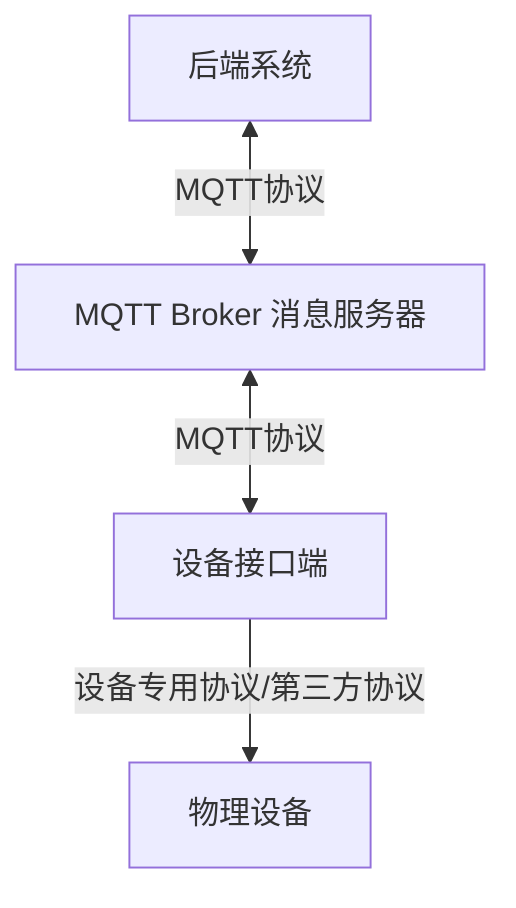
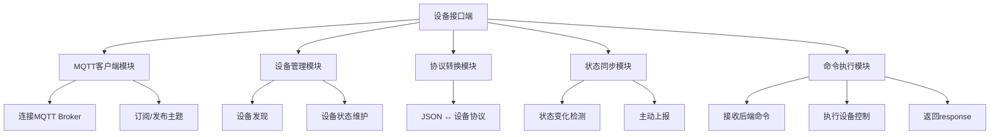
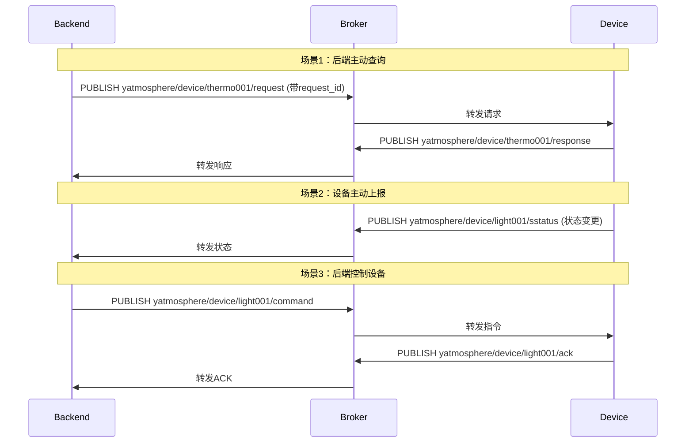

# Yatmosphere 智能家居控制系统架构设计——设备接口端(Gateway)

## 一、整体架构



## 二、技术栈

- 语言: Python 3.11+  
- 库:
  - paho-mqtt    # MQTT客户端库
  - PyYAML       # 配置文件解析

## 三、设备接口端(Gateway)详细设计

### 1. 模块组成



### 2. 通信流程



**2.1 后端获取设备信息**
```
后端 → MQTT Broker → 设备接口端 → 物理设备
      (发布/get_device_info)      (获取设备状态)
      
物理设备 → 设备接口端 → MQTT Broker → 后端
                        (发布/device_info)
```

**2.2 后端设置设备参数**
```
后端 → MQTT Broker → 设备接口端 → 物理设备
      (发布/set_device_params)    (应用设置)
      
物理设备 → 设备接口端 → MQTT Broker → 后端
                        (发布/response)
```

**2.3 设备状态主动上报**
```
物理设备 → 设备接口端 → MQTT Broker → 后端
(状态变化)             (发布/device_status_update)
```

## 四、通信协议设计规范

### 1. MQTT主题设计

| **主题类型**     | **格式**                        | **说明**             |
|------------------|---------------------------------|----------------------|
| 设备状态上报     | `device/<device_id>/status`      | 设备主动/被动上报状态 |
| 后端下发指令     | `device/<device_id>/command`     | 控制/查询设备        |
| 设备响应指令     | `device/<device_id>/response`    | 设备命令执行响应     |
| 设备注册         | `device/register`                | 注册新设备           |
| 设备注册响应     | `device/registered`              | 注册结果通知         |
| 设备注销         | `device/unregister`              | 注销设备            |
| 设备注销响应     | `device/unregistered`            | 注销结果通知         |

### 2. 消息格式规范（JSON）

#### 2.1 设备状态主动上报（status）

- 状态响应 (gateway → backend)

```json
{
  "msg_id": "uuidv4",
  "msg_type": "status",
  "device_type": "light",
  "device_id": "light_001",
  "power": "on",
  "brightness": 80,
  "color": "#ffffff"
}
```

#### 2.2 后端下发指令（command）

- 设置参数 (backend → gateway)

```json
{
  "msg_id": "uuidv4",       // 消息唯一标识
  "msg_type": "command",
  "device_type": "light",
  "device_id": "light_001",
  "action": "set_power", // 设置开/关
  "value": "on"
}
```

- 状态查询 (响应用 **msg_type: status**) (backend → gateway)

```json
{
  "msg_id": "uuidv4",
  "msg_type": "command",
  "device_type": "light",
  "device_id": "light_001",
  "action": "get_status" // 状态查询
}
```

#### 2.3 设备响应指令（response）

- 指令响应 (gateway → backend)

```json
{
  "msg_id": "uuidv4",       // 消息唯一标识
  "msg_type": "response",
  "status": "success",      // success/failed
  "related_msg_id": "uuidv4", // 关联的command消息ID
  "error_code": 0,           // 错误码（0表示成功）
  "error_msg": ""            // 错误描述
}
```

#### 2.4 设备注册（register）

- 注册请求 (backend → gateway)

```json
{
  "msg_id": "req_123",
  "msg_type": "register",
  "device_id": "light_001",
  "device_type": "light"
}
```

#### 2.5 设备注册响应（registered）

- 注册响应 (gateway → backend)

```json
{
  "msg_id": "resp_456",
  "msg_type": "registered",
  "device_id": "light_001",
  "status": "success",      // success/failed
  "related_msg_id": "req_123", // 关联的command消息ID
  "error_msg": ""           // 失败时填写
}
```

#### 2.6 设备注销（unregister）

- 注销请求 (backend → gateway)

```json
{
  "msg_id": "req_789",
  "msg_type": "unregister",
  "device_id": "light_001"
}
```

#### 2.7 设备注销响应（unregistered）

- 注销响应 (gateway → backend)

```json
{
  "msg_id": "resp_790",
  "msg_type": "unregistered",
  "device_id": "light_001",
  "status": "success",      // success/failed
  "error_msg": ""           // 失败时填写
}
```

### 3. 错误码规范
| 错误码 | 说明                  |
|--------|----------------------|
| 0      | 成功                  |
| 400    | 参数错误              |
| 403    | 设备忙（无法立即执行） |
| 404    | 设备离线              |
| 500    | 设备内部错误          |

### 4. 支持的 command 指令 (`device/<device_id>/command`时)

#### 4.1 智能灯 light

| action           | 说明         | value类型 | 示例值      |
|------------------|--------------|----------|-------------|
| set_power        | 设置开关      | string   | "on"/"off"  |
| set_brightness   | 设置亮度      | int      | 0~100       |
| set_color_temp        | 设置色温      | string   | "暖光"/"自然"/"冷光"   |
| get_status       | 查询当前状态  | 无       |             |

#### 4.2 智能空调

| action           | 说明         | value类型 | 示例值      |
|------------------|--------------|----------|-------------|
| set_power        | 设置开关      | string   | "on"/"off"  |
| set_temperature  | 设置温度      | int      | 16~30       |
| set_mode   | 设置模式      | string      | "制冷"/"制热"/"除湿"/"送风"       |
| set_eco        | 设置节能模式      | string   | "on"/"off"    |
| set_fan_level  | 设置风速        | int      | 1~5         |
| set_timer      | 设置定时器      | int      | >=0 (分钟)         |
| get_status       | 查询当前状态  | 无       |             |

## 五、项目结构（暂定）

```
yatmosphere/
├── backend/                   # 后端系统
│   └── src/
│       └── app.js             # 主入口
├── gateway/                   # 设备接口端
│   └── src/
│       ├── main.py            # 主程序，初始化、事件循环
│       ├── mqtt_client.py     # MQTT客户端，负责与MQTT Broker的通信
│       ├── device_manager.py  # 设备管理
│       └── protocols/         # 协议转换    
│           └── ...
├── virtual_devices/           # 模拟设备
│   ├── const.py               # mqtt配置
│   ├── virtual_device.py      # 模拟设备基类
│   ├── light.py               # 智能灯
│   └── ...                
├── config/                    # 配置文件
│   └── ... 
└── frontend/                  # 前端
    └── ...
```

## 六、运行测试

- MQTT Broker版本：EMQX，开源版功能完善，支持百万级连接
- 部署方式：Docker容器

```bash
# 终端1 - 启动MQTT Broker (EMQX)
docker run -d --name emqx -p 1883:1883 -p 8083:8083 emqx/emqx:latest

# 终端2 - 启动网关
cd yatmosphere
pip install -r requirements.txt
export PYTHONPATH=$PYTHONPATH:$(pwd) # 在当前终端会话设置工作路径
python gateway/src/main.py
```

- 基础响应验证

创建设备：

```sh
# 终端1：监听设备创建响应
mosquitto_sub -t "device/registered"

# 终端2：设备创建
mosquitto_pub -t "device/register" -m '{
  "msg_id": "test_001",
  "device_id": "light_001",
  "device_type": "light"
}'
```

测试场景：发送开灯指令 → 验证设备返回ACK

```bash
# 终端1：监听设备命令响应
mosquitto_sub -h localhost -t "device/light_001/response" -v

# 终端2：监听设备状态响应
mosquitto_sub -h localhost -t "device/light_001/status" -v

# 终端3：发送开灯指令
mosquitto_pub -h localhost -t "device/light_001/command" -m '{
  "msg_id": 1001,
  "timestamp": 1630000000,
  "device_type": "light",
  "device_id": "light_001",
  "msg_type": "command",
  "action": "set_power",
  "value": "on"
}'
```

- 预期响应：
```json
device/light_001/response {
  "msg_id": 1002,
  "msg_type": "response",
  "status": "success",
  "related_msg_id": 1001,
  "timestamp": 1630000001 //时间戳，根据测试时UNIX时间戳生成
}
```

删除设备：

```sh
# 终端1：监听设备删除响应
mosquitto_sub -t "device/unregistered"

# 终端2：设备删除
mosquitto_pub -t "device/unregister" -m '{
  "msg_id": "test_002",
  "device_id": "light_001"
}'
```

## 七、参考资料

- https://github.com/kerwincui/wumei-iot
- https://fastbee.cn/doc/link/mqtt.html#%E4%B8%89%E3%80%81%E8%AE%BE%E5%A4%87%E4%BA%A4%E4%BA%92

