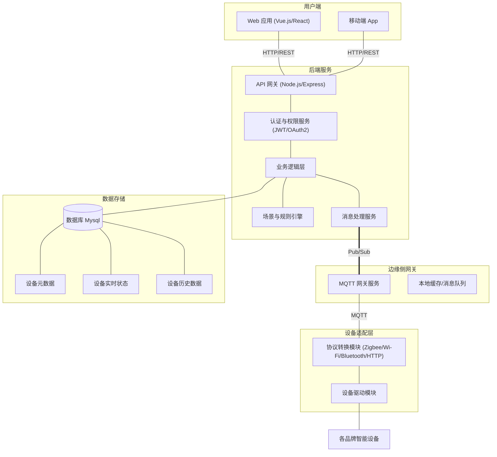
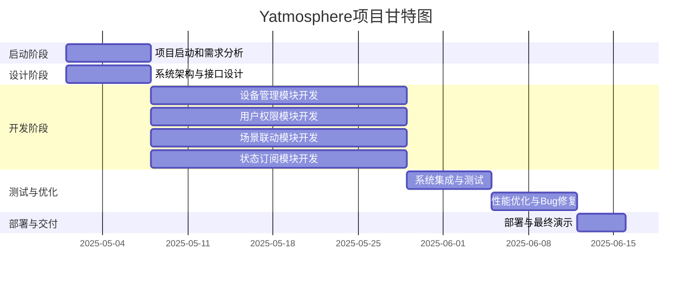

# Yatmosphere项目计划书

**项目名称**：Yatmosphere智能家居控制系统
**项目周期**：2025年5月1日 - 2025年6月15日（功能实现截止2025年6月7日）

## 一、项目介绍

### 项目背景

随着物联网和智能设备的迅速普及，全球智能家居市场持续高速增长。据统计，全球智能家居市场预计在2025年将达到1740亿美元。用户对家庭自动化的需求不断提升，希望通过语音、手机或自动化规则，实现灯光、温控、安全等设备的互联控制。然而，现有智能家居系统往往碎片化严重，不同品牌、不同协议的设备缺乏统一平台，安全性和可扩展性也亟待提高。因此，开发一个统一的智能家居控制平台——“Yatmosphere”具有重要意义，不仅能提升用户体验，还能提高系统安全与运行效率。

全屋智能设备一体化控制系统旨在为用户提供一个集中、统一的界面和接口，实现对家中各种智能设备（如智能灯光、空调、窗帘、安防设备等）的便捷控制与管理，提升家居智能化体验和生活品质。

### 项目简介

项目的英文名称定为 **Yatmosphere**。“Yatmosphere”灵感来自“atmosphere”（大气层），寓意系统将为智能家居营造一个统一而智能的“环境氛围”，实现对家庭设备的全局感知和控制。Yatmosphere智能家居控制系统旨在打造一个融合多种智能设备的统一管理平台，为用户提供智能化、便利化的家居环境控制体验。团队通过物联网技术，实现对家用电器、照明、安防等设备的远程监控与集中控制，提升生活质量和安全性。同时，项目代码托管于 GitHub，仓库地址为：[Yatmophere](https://github.com/sysu-orz/yatmosphere)；团队文档协作地址为：[wps协作文档](https://wpsplus.com/join/gxkmzxd?invtoken=S25pZ2h0REFJ)

## 二、系统设计

### 总体架构

- **前端用户界面**（基于Vue3的Web**和**移动端应用），负责设备监控、操作和场景管理（具体界面设计可参考[Home Assistant](https://www.home-assistant.io/)）；
- **后端服务**（基于Node.js + Express或者其他技术栈），提供API和WebSocket接口，处理业务逻辑和数据存储；
- **消息中间件**（采用MQTT协议），用于设备通信和状态订阅，实现设备之间以及设备与服务器之间的低延时交互；
- **数据库**（MySQL），用于持久化存储设备信息、用户权限、场景配置等。

系统主要特性包括：设备统一注册与管理、多用户权限控制、灵活的场景联动规则（如条件触发自动执行动作）、实时状态订阅与推送、远程监控与历史数据查询等。所有功能模块将模块化设计，前后端分离，确保高内聚低耦合。

### 项目模块

- **设备管理模块**：负责智能设备的注册、配置、查询和控制。包括设备的增删改查接口、设备状态同步及历史数据存储。可以为不同品牌或类型的设备建立统一模型，维护设备ID、类型、名称、位置信息等。核心建议将设备信息存入数据库，并通过后端接口接收前端指令后发布到对应的MQTT主题，实现对设备的控制。设备管理模块应支持热插拔设备、在线离线状态监测和设备分组管理。
- **场景联动模块**：支持定义用户自定义的自动化场景（if-then规则）。例如，设定“当时间为晚上7点且有人在家时，打开客厅灯并启动空调”。场景模块需要实现触发条件的检测（时间、设备状态、传感器数据等）以及执行动作（控制设备开关或调整参数等）。建议采用事件驱动或调度器机制：可以使用定时任务（如cron）检查时间触发，也可以让设备状态变化通过MQTT触发事件，由后台监听处理。对于复杂场景，可设计规则引擎或编写脚本式配置，从而实现灵活扩展。
- **用户权限模块**：负责用户身份认证和权限管理。系统应支持多用户登录，角色权限控制（如管理员、家主、普通用户、访客等）。核心功能包括用户注册登录、密码加密存储、权限校验。可以在数据库中维护用户表和角色表，通过数据库或配置文件管理各角色对设备和功能的访问权限（例如“家主”可任意控制所有设备，而“访客”只能查看）。建议在API层面统一检查Token并进行授权验证，防止未授权访问。
- **状态订阅模块**：负责设备状态的实时订阅与分发。系统通过MQTT中间件接收各设备发布的状态消息，然后将更新推送给前端界面。前端可通过WebSocket长连接或Server-Sent Events（SSE）订阅状态更新，实现实时显示。例如，当传感器检测到门磁打开，后端即时将事件通过WebSocket推送给客户端。结合MQTT的发布/订阅机制，该模块可高效地广播设备状态变更，确保UI和控制逻辑同步最新状态。
- **协议适配模块**：该模块位于设备和平台之间，负责不同智能家居协议的兼容与适配。利用MQTT作为核心通信协议，设备端通过MQTT将数据发布到服务器，服务器通过订阅主题获取并处理。模块应实现设备指令与MQTT消息的互译，以及对异构设备协议的封装。考虑到MQTT是物联网应用的行业标准，特别适合带宽受限、连接中断的场景，协议适配模块应充分利用MQTT的发布/订阅特性，确保设备与系统的松耦合通信。根据需要，可对接第三方网关或桥接服务，将不同协议（如Zigbee、BLE）接入到统一MQTT Broker下。

### 技术选型

- **前端框架**：采用 **Vue 3**或其他技术栈。Vue3支持组件化开发和组合式API，具备更好的性能和可维护性。其生态完善，可使用Vue Router做路由管理，Vuex/Pinia做状态管理，Element-UI或Vuetify等组件库加快开发效率。
- **后端框架**：使用 **Node.js + Express**或其他技术栈。Node.js适用于高并发场景，事件驱动的特点符合IoT消息的处理需求。Express轻量简洁，便于快速构建RESTful API。
- **数据库**：选用 **MySQL** 关系型数据库。MySQL支持事务和强一致性，适合存储用户数据、设备信息和场景配置等结构化数据。对于复杂查询和报表也很高效。可以借助MySQL Workbench等工具进行可视化管理（若需使用MongoDB，可用MongoDB Compass进行文档型数据管理）。
- **协议中间件**：采用 **MQTT** 协议。MQTT是一种轻量级发布/订阅消息协议，非常适合智能家居设备通信。系统可部署Mosquitto或EMQX等MQTT Broker，设备与平台通过主题(topic)交互数据，确保可靠的消息转发和可扩展性。
- **辅助工具**：
  - **Postman**：用于API接口调试和测试，以及保存常用请求集合。
  - **Docker**：用于容器化部署后端服务和数据库，实现环境隔离和快速部署。开发环境和生产环境可使用同一镜像，提高一致性。
  - **数据库管理工具**：如MySQL Workbench，用于可视化查看和管理数据库（表结构、数据、索引等）。
  - **其他**：可使用ESLint/Prettier进行代码规范检查，使用Jest/Mocha编写单元测试，使用Nginx或PM2进行后端进程管理和负载均衡。

**如若有其他更好的技术栈，可随时调整，以上技术栈供参考**

## 三、项目组织与分工

### 团队结构

为确保项目顺利推进，我们明确以下团队结构和角色分工：

- **项目经理**：负责总体项目规划和进度管理，协调团队资源与沟通，跟进项目里程碑。监督项目进度和风险，组织例会，确保项目按时保质完成。
- **产品经理**：负责市场调研与需求分析，与用户和利益相关者沟通，整理功能需求并形成需求文档；确定产品定位和功能优先级；评审需求变更。
- **系统架构师/技术负责人**：主导系统总体架构设计和技术选型，制定系统框架和接口规范，对关键技术问题进行预研，并指导各模块开发。
- **硬件开发工程师**：负责传感器、控制器等硬件设备的选型与集成，包括传感器模块集成、微控制器编程、嵌入式系统开发等。
- **软件开发工程师**：负责后端和前端的系统开发。后端工程师负责服务器端开发、数据库设计、API接口实现等；前端工程师负责移动App或Web界面开发，实现用户交互与展示。
- **测试工程师**：制定测试计划和测试用例，对功能进行单元测试、集成测试和系统测试，负责系统的质量保障；定期编写测试报告并反馈问题。
- **运维工程师**：负责云平台和服务器的部署与维护，监控系统运行状态，确保服务稳定可用；编写部署说明和用户手册。

团队各角色分工明确，定期沟通会议保持信息同步，确保产品需求、设计和实施相互对齐。每个成员对自己的职责范围负责，同时跨职能协作，共同推进项目进展。

### 部门与人员配置

项目团队共有10人。团队成员根据特长自由选择分工，确保覆盖系统开发和部署所需的各类角色。主要分工可能包括：

| 小组              | 建议人数 | 职责                                                                                         |
| ----------------- | -------- | -------------------------------------------------------------------------------------------- |
| 前端开发          | 3        | 开发 Web 与移动端界面，组件设计、状态管理、与后端 API 对接                                   |
| 后端开发          | 2–3      | 负责服务器和数据库设计，提供设备控制和数据存储接口                                           |
| 设备接口/协议适配 | 1–2      | 实现 MQTT 通信、各品牌协议适配器、设备驱动                                                   |
| UI/UX 设计        | 1–2      | 视觉设计、交互原型、用户体验优化                                                             |
| 安全组            | 1–2      | 身份认证、权限管理、数据加密、网络安全策略实施                                               |
| 测试与运维        | 1–2      | 编写技术文档和用户手册、编写测试用例、执行功能与性能测试；CI/CD 管道、部署脚本、生产环境运维 |

**团队成员**：马岱，黄集瑞、金鹏飞、潘文磊、潘致远、汪丁宇洋、谢泽中、张管文、张贞蔚、庄云皓。各成员可根据兴趣和专长灵活加入上述各小组，不做强制分配。

## 四、项目计划

### 项目周期

项目总周期为 **2025年5月1日–6月15日**。其中功能开发阶段需在 **6月7日** 前完成，剩余时间进行系统集成、测试、优化和最终验收。

### 每周目标

- **第1周（5/1–5/7）**：项目启动，完成需求分析和初步系统架构设计，确定技术选型和文档规范。进行系统详细设计，包括数据库设计、API接口定义、前端原型UI设计。编写详细设计文档和接口规范。
- **第2、3、4周（5/8–5/28）**：核心功能开发开始，前后端并行推进。主要完成设备管理和用户权限模块的开发，实现设备注册、查询、控制接口以及用户登录注册、角色权限设置等基础功能。完成场景联动模块和状态订阅模块的实现。场景模块支持定义触发条件和执行动作；状态订阅模块通过MQTT和WebSocket推送设备状态到前端。
- **第5周（5/29–6/4）**：系统集成与测试，前后端联调，完善剩余功能。进行功能测试和修复BUG，确保各模块协同工作；编写单元测试、集成测试用例。
- **第6周（6/5–6/11）**：性能优化和Bug修复。根据测试反馈优化系统性能、数据库索引、消息处理效率等；完成错误修复和稳定性提升。
- **第7周（6/12–6/15）**：部署与验收，撰写最终文档，准备演示。进行系统部署（可使用Docker容器化），编写部署手册和演示脚本，准备项目汇报材料和演示视频。

### 甘特图

## 五、风险管理

为确保项目顺利进行，团队需预见并管理可能的风险。主要风险包括技术实现难度、外部接口兼容性问题、时间不足等。针对这些风险，团队将采取以下措施：

- **技术风险**：对于不熟悉或复杂的技术点（如新设备的接入协议），预留缓冲时间进行预研，并及时寻求指导或参考开源案例。
- **沟通协作风险**：保持定期会议和敏捷评审，及时同步进度和问题，采用 GitHub 和 WPS 平台进行持续沟通和反馈。
- **进度风险**：根据甘特图及时调整计划，若开发进度落后，可通过优化方案或减少非核心功能的方式进行调整。
- **质量风险**：加强测试力度，对主要功能进行充分的单元测试和集成测试，确保高优先级的功能如期实现并稳定运行。

## 六、项目开发规范

为确保开发过程的高效和规范，项目团队将采用以下开发流程和规范：

- **版本控制与分支策略**：使用 GitHub 作为代码版本管理平台。采用 **main** 分支作为主分支，所有发布至生产环境的稳定代码均合并入该分支。开发工作在各自的功能分支 (**feature/**) 上进行，例如 `feature/设备接入`、`feature/前端UI` 等。完成开发任务后，通过提交 Pull Request（PR）方式将变更合并到主分支，至少经过一名团队成员的评审通过后合并。
- **提交与评审**：所有开发者在本地完成代码编写后，先推送至对应的功能分支并创建 PR，要求提交清晰的变更描述和相关测试用例。团队采用 Code Review 机制，审阅人员检查代码质量、功能完整性和安全性，确保符合编码规范后方可合并。
- **代码规范**：前后端代码遵循统一的编码风格和最佳实践（如合理的命名、注释和缩进等），编写必要的单元测试。所有关键功能模块必须有相应的测试用例，并确保测试通过后再进行合并。
- **持续集成与部署**：在 GitHub 上配置持续集成流水线，实现自动构建和简单测试。每次合并到主分支后，触发自动部署流程，确保代码变更及时上线测试环境，便于及时发现问题。

## 七、文档结构与交付成果

项目交付内容将包括完整的软件系统及其相关文档资料，所有文档采用 Markdown 格式进行编写，并统一托管在 GitHub 仓库（[Yatmophere](https://github.com/sysu-orz/yatmosphere)）和 WPS 协作平台（[WPS 协作文档](https://wpsplus.com/join/gxkmzxd?invtoken=S25pZ2h0REFJ)）中，便于团队协同开发与版本控制。文档撰写需遵循统一模板和专业术语规范，确保文档条理清晰、内容完整，便于项目协作和后期维护。项目交付成果主要包括以下几类：

### 项目文档

* **项目计划书**：本文件，描述项目总体规划、团队分工、开发规范与进度安排；
* **需求规格说明书**：详细列出功能需求（如用户控制、设备接入）与非功能需求（如安全性、性能要求）；
* **系统设计文档**：
  * 架构设计：系统整体架构图、微服务结构等；
  * 数据库设计：ER图、表结构说明；
  * 模块说明：各功能模块职责与数据流；
* **接口文档（API）**：前后端接口设计说明，支持通过 Swagger/OpenAPI 等工具自动生成；
* **用户与开发手册**：
  * 用户手册：面向终端用户的系统使用指南；
  * 开发者手册：代码结构说明、开发流程、编码规范、依赖说明等；
* **部署与运维手册**：
  * 环境配置说明（Node.js、MongoDB、Nginx、Docker 等）；
  * 服务器部署流程（如Dockerfile、docker-compose、PM2配置等）；
  * IaC脚本（如Terraform/Ansible，若有）；
* **测试文档**：测试用例文档；测试执行记录与结果报告；Bug记录与修复进度；
* **演示与成果说明**：功能演示视频或脚本；示例数据与测试账户；项目展示文稿或幻灯片；
* **项目管理文档**：需求评审记录；迭代计划与版本发布日志；第三方依赖清单及许可证说明。

### 源代码与技术资产

* **完整源代码**：包含前端、后端、数据库及公共组件，结构清晰，代码注释规范；
* **README 文档**：简要介绍项目目标、启动步骤、依赖安装等；
* **CI/CD 配置**：如 GitHub Actions、Docker 构建脚本、部署流水线等。

### 最终交付清单

| 类别     | 内容                                     |
| -------- | ---------------------------------------- |
| 软件系统 | 智能家居控制平台（前端+后端+数据库）     |
| 项目文档 | 各类设计文档、说明书、测试报告等（见上） |
| 部署资料 | Dockerfile、nginx配置、环境变量模板等    |
| 演示材料 | 演示视频/脚本、PPT、示例数据             |
| 版本控制 | GitHub 仓库代码及文档版本历史            |

所有文档需定期审阅与更新，提交修改建议通过 Pull Request 合并至主仓库。甘特图采用 Mermaid 语法绘制，便于版本控制与在线展示，嵌入在项目文档或 README 中以供查看。

