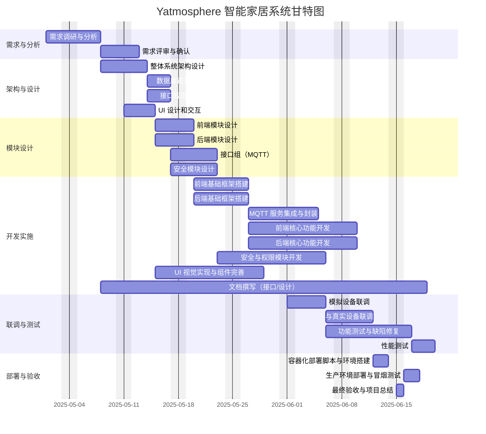

# 项目管理文档

## 一、项目概述

**项目名称**：Yatmosphere 智能家居控制系统
**执行周期**：2025年4月22日 – 2025年6月15日
**项目目标**：

- 构建全屋智能设备一体化控制平台
- 实现设备管理、远程控制、场景联动、实时监测、安全权限等功能
- 采用前后端分离+MQTT 通信架构，保障可扩展、高可用

---

## 二、项目计划制定

### 2.1 里程碑 & 时间节点

| 里程碑编号 | 里程碑名称          | 节点说明                                       | 开始日期 | 结束日期 | 责任人        |
| ---------- | ------------------- | ---------------------------------------------- | -------- | -------- | ------------- |
| M1         | 需求确认 & 评审     | 完成需求规格说明书评审                         | 04-22    | 05-07    | 马岱          |
| M2         | 模块设计完成        | 提交各子系统（前端、后端、UI、安全）设计方案   | 05-08    | 05-14    | 各模块负责人  |
| M3         | 核心开发完成        | 前后端核心功能（设备管理、控制、场景）开发完成 | 05-15    | 06-04    | 前后端全体    |
| M4         | 系统集成 & 测试优化 | 完成联调、功能测试、性能调优                   | 06-05    | 06-11    | 测试 & 开发   |
| M5         | 部署上线 & 验收     | 完成生产环境部署并通过最终验收                 | 06-12    | 06-15    | 运维 & 项目组 |

### 2.2 每周目标

| 周次      | 日期范围          | 主要目标                                                                                                                                      |
| --------- | ----------------- | --------------------------------------------------------------------------------------------------------------------------------------------- |
| **第1周** | 4月22日 — 4月30日 | - 完成需求调研与访谈，梳理关键用户场景与功能列表<br />- 撰写并评审《需求规格说明书》<br />- 搭建 Jira 看板与 GitHub 仓库框架                  |
| **第2周** | 5月1日 — 5月7日   | 完成系统总体架构设计（组件图、模块划分）<br />- 设计数据库 ER 模型并评审<br /> - 定义 REST/MQTT 接口规范<br /> - 输出 UI 原型与交互流程       |
| **第3周** | 5月8日 — 5月14日  | - 各模块（前端、后端、接口组、安全）详细设计并评审<br />- 编写 Swagger/OpenAPI 文档模板<br /> - UI 视觉设计稿定稿与交互标注                   |
| **第4周** | 5月15日 — 5月21日 | - 前端/后端基础框架初始化（项目脚手架、依赖配置）<br />- 接口组完成 MQTT Service 封装与 Mock 测试 <br />- 安全模块完成认证方案 & 数据加密设计 |
| **第5周** | 5月22日 — 5月28日 | - 前端核心功能（设备列表、控制面板、场景管理）开发<br />- 后端核心业务（设备管理、场景引擎、状态订阅）开发<br /> - 同步编写接口与设计文档     |
| **第6周** | 5月29日 — 6月4日  | - 前端核心功能（设备列表、控制面板、场景管理）开发<br />- 后端核心业务（设备管理、场景引擎、状态订阅）开发 <br />- 同步编写接口与设计文档     |
| **第7周** | 6月5日 — 6月11日  | - 完成仿真设备与真实设备 MQTT 联调<br />- 功能测试、缺陷修复<br /> - 性能测试与优化（消息吞吐、并发订阅）                                     |
| **第8周** | 6月12日 — 6月15日 | - 容器化部署脚本与生产环境部署<br />- 冒烟测试与最终验收 <br />- 编写项目总结报告与移交文档                                                   |

### 2.3 甘特图



## 三、团队组织与分工

### 3.1 团队结构

为确保项目顺利推进，我们明确以下团队结构和角色分工：

| 角色       | 职责说明                                                                                                   |
| ---------- | ---------------------------------------------------------------------------------------------------------- |
| 项目经理   | 需求对接、进度监控、风险管理、资源协调、里程碑评审                                                         |
| 前端工程师 | 负责 Web 与移动端界面开发，与后端 API 和 MQTT/WebSocket 对接，保证 UI 与交互一致                           |
| UI 设计师  | 完成各终端页面低/高保真原型及视觉设计，输出界面资源（Sketch/Figma/Adobe XD），并提供色彩、图标、动效规范   |
| 后端工程师 | 设计并实现业务接口（Spring Boot）、MQTT 客户端、场景引擎、数据库持久化、集成测试、性能调优                 |
| 接口开发   | MQTT 消息通信实现、消息格式、主题规范、测试对接；验证前后端接口契约，编写接口自动化测试用例                |
| 安全工程师 | 设计并实现用户认证/授权机制（JWT/OAuth2）、审计日志、输入校验、防 XSS/CSRF、依赖漏洞扫描、安全测试         |
| 测试工程师 | 编写测试计划与用例（功能、接口、性能、安全）、执行测试并跟踪问题，生成测试报告；与开发人员协作完成回归测试 |
| 运维工程师 | 设计部署架构（Docker / Kubernetes）、编写 CI/CD 脚本、管理测试/生产环境、监控告警、故障恢复                |

团队各角色分工明确，定期沟通会议保持信息同步，确保产品需求、设计和实施相互对齐。每个成员对自己的职责范围负责，同时跨职能协作，共同推进项目进展。

### 3.2 部门与人员配置

项目团队共有10人。团队成员根据特长自由选择分工，确保覆盖系统开发和部署所需的各类角色。主要分工可能包括：

| 小组              | 建议人数 | 职责                                                                                         |
| ----------------- | -------- | -------------------------------------------------------------------------------------------- |
| 前端开发          | 3        | 开发 Web 与移动端界面，组件设计、状态管理、与后端 API 对接                                   |
| 后端开发          | 2–3      | 负责服务器和数据库设计，提供设备控制和数据存储接口                                           |
| 设备接口/协议适配 | 1–2      | 实现 MQTT 通信、各品牌协议适配器、设备驱动                                                   |
| UI/UX 设计        | 1–2      | 视觉设计、交互原型、用户体验优化                                                             |
| 安全组            | 1–2      | 身份认证、权限管理、数据加密、网络安全策略实施                                               |
| 测试与运维        | 1–2      | 编写技术文档和用户手册、编写测试用例、执行功能与性能测试；CI/CD 管道、部署脚本、生产环境运维 |

### 3.3 组织结构

**团队成员**：马岱，黄集瑞、金鹏飞、潘文磊、潘致远、汪丁宇洋、谢泽中、张管文、张贞蔚、庄云皓。

```
项目经理：马岱
│
├── 前端组 (4 名)
│ ├─ 前端工程师：谢泽中（负责人）、汪丁宇洋、张管文
│ └─ 前端/移动集成：潘致远
│
├── UI 设计 (1 名)
│ └─ 视觉 & 原型：潘致远
│
├── 后端组 (3 名)
│ ├─ 后端工程师：庄云皓（负责人）
│ ├─ 技术负责人：金鹏飞
│ └─ 架构 & 服务：马岱
│
├── 接口组 (2 名)
│ └─ 中间层维护：张贞蔚（负责人）、潘文磊
│
├── 安全组 (1 名)
│ └─ 用户管理 & 安全维护：黄集瑞
│
└── 测试 & 部署 (2 名)
│ └─ 马岱、潘文磊
```

---

## 四、进度监控与风险管理

### 4.1 进度监控

* **每日站会**：前端/后端/测试分别汇报前日完成、当日计划、阻碍点
* **周度评审**：每周四召开进度评审会，检查甘特图任务完成情况
* **看板管理**：Jira 划分 Epic → Story → Task，实时更新 Done/Doing/ToDo 状态
* **燃尽图**：Sprint 燃尽图监控剩余工作量

### 4.2 风险识别与应对

| 风险类别     | 风险描述                     | 可能性 | 影响 | 应对策略                              |
| ------------ | ---------------------------- | ------ | ---- | ------------------------------------- |
| 技术风险     | MQTT、大数据量场景下性能瓶颈 | 中     | 高   | 提前搭建压力环境测试，优化 Broker/QoS |
| 接口兼容风险 | 前后端接口不一致导致联调失败 | 高     | 中   | 接口文档+Mock 服务+Swagger 自动化测试 |
| 人员风险     | 关键人员离职或任务遗漏       | 低     | 高   | 每个模块双人负责，知识共享            |
| 进度风险     | 功能开发延迟                 | 中     | 中   | 精细化拆分任务、调整优先级            |
| 安全风险     | 权限绕过、数据泄露           | 低     | 高   | 安全组渗透测试、代码审计              |
| 部署风险     | 环境差异导致线上部署失败     | 低     | 中   | Docker 化部署、CI/CD 全链路测试       |

---

## 五、项目管理规范

* **分支策略**：`main`（生产）+ `develop`（集成）+ `feature/{name}`
* **版本管理**：Semantic Versioning，发布打 Tag
* **代码评审**：每个 PR 至少 1 人 Review
* **提交规范**：Conventional Commits
* **文档管理**：Markdown + Swagger/OpenAPI，集中 git 管理
* **会议频率**：日会（15 分钟）、周会（1 小时）、里程碑评审

---

## 六、沟通与报告

* **沟通工具**：微信群、GitHub Issues、Jira
* **日报/周报**：钉钉群日报，周五发送周报邮件
* **里程碑报告**：里程碑前 1 天提交 PPT 演示

---

## 七、附件

* **项目计划甘特图**（本文档 §2.2）
* **团队组织结构图**（本文档 §3）
* **Jira 项目链接**：
* **GitHub 仓库**：[https://github.com/sysu-orz/yatmosphere](https://github.com/sysu-orz/yatmosphere)

---

> **至此，项目管理文档编制完毕**，请各位成员对照执行，有问题及时在项目群或 Jira 中反馈。
> 祝项目圆满成功！
